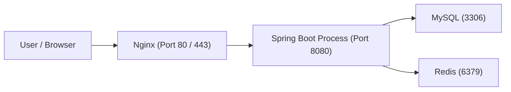

# Server and Runtime Basics (Foundation for Distributed Systems)

## Goal

Understand what a server actually is, how a backend application runs on it, how requests reach the application, and how databases and Redis can run on the same machine.

This is the foundation before learning distributed systems.

> **Technology Agnostic Note:** Although examples in these notes use **Spring Boot (Java)**, the concepts discussed here—servers, processes, threads/concurrency, networking, databases, Redis, transactions, and distributed systems—are **technology agnostic** and apply equally to backend services built with Go, Node.js, Python, .NET, Rust, or any other server-side framework. Only the application runtime and concurrency model differ.

---

# 1. What is a Server?

## Simple Definition

A **server is simply a computer** whose job is to serve requests from other computers over a network.

A laptop and a server have the same basic components:

- CPU
- RAM
- SSD/HDD
- Network Interface Card (NIC)
- Operating System

The difference is mainly in **hardware, reliability, and workload**, not in the definition.

| Laptop | Server |
|--------|--------|
| Personal use. | Serves requests from many users. |
| 4–16 CPU cores. | 16–128+ CPU cores. |
| 8–32 GB RAM. | 64 GB to TBs of RAM. |
| Normal SSD. | Enterprise SSDs, RAID storage. |
| Used interactively. | Runs continuously (24x7). |

> **Interview takeaway:** A server is a specialized computer optimized to continuously run applications and handle network requests.

---

# 2. What Lives Inside a Server?

A deployed backend application is just a **process** running on the operating system.

The server contains:

- Operating System (Linux in most production systems).
- Backend application (Spring Boot process).
- Database process (MySQL/PostgreSQL).
- Cache process (Redis).
- Web server (Nginx).

Each of these runs as an independent OS process.

---

# 3. Where Does the Backend Code Live?

## Before Running

The application file is stored permanently on disk (SSD/HDD).

Example:

```text
/opt/apps/orders-service.jar
```

## After Running

The operating system loads the application into RAM and creates a process.

The process contains:

- Code segment.
- Heap memory.
- Stack memory.
- Thread stacks.
- JVM memory (for Java applications).

| Disk (SSD) | RAM |
|------------|-----|
| Stores application permanently. | Stores the running application temporarily. |

---

# 4. What is a Process?

A **process** is a running instance of an application.

Example:

```bash
java -jar orders-service.jar
```

The OS creates:

- Process ID (PID).
- Memory allocation.
- Threads.
- File descriptors.
- Network sockets.

**One backend service = One operating system process.**

---

# 5. What is Nginx?

Nginx is **not your backend application**.

It is a **Web Server + Reverse Proxy**.

## Responsibilities

- Accept HTTP/HTTPS requests.
- Listen on ports **80** and **443**.
- Forward requests to backend services.
- Serve static files (HTML/CSS/JS/images).
- Perform load balancing (later in distributed systems).

---

## Request Flow



**Flow Explanation**

1. Browser sends request to the server.
2. Nginx receives it on port **80** or **443**.
3. Nginx forwards it internally to Spring Boot.
4. Spring Boot executes business logic.
5. Spring Boot talks to MySQL/Redis if needed.

---

# 6. Why Ports Exist

A server can run multiple applications simultaneously.

Ports identify **which process** should receive incoming traffic.

| Service | Default Port |
|----------|--------------|
| HTTP | 80 |
| HTTPS | 443 |
| Spring Boot | 8080 |
| MySQL | 3306 |
| Redis | 6379 |

### Example

Browser requests:

```
https://blinkit.com
```

Internally:

- Browser connects to **443**.
- Nginx listens the request traffic on port 443, when browser connects to port 443 (using our Nginx IP Address) and browser sends the request to Nginx then it forwards request to **8080** (Our application port).
- User never sees port **8080**.

---

# 7. Can MySQL and Redis Run on the Same Server?

**Yes.**

Each service is an independent operating system process.

| Process | Port |
|----------|------|
| Spring Boot | 8080 |
| MySQL | 3306 |
| Redis | 6379 |
| Nginx | 80 / 443 |

The operating system isolates these processes.

---

# 8. How Spring Boot Connects to MySQL

Spring Boot stores database configuration.

Example:

```properties
spring.datasource.url=jdbc:mysql://localhost:3306/orders
```

Meaning:

- Host → localhost.
- Port → 3306.
- Database → orders.

Spring Boot opens TCP connections to MySQL using this configuration.

---

# 9. Threads Inside Spring Boot

Spring Boot uses an embedded Tomcat server.

Tomcat maintains a **thread pool**.

### Example

- 200 worker threads available.
- Every incoming request gets one free worker thread.
- After the request completes, the thread returns to the pool.

Threads are **reused**, not recreated for every request.

---

# 10. Who Creates These Threads?

Tomcat creates the worker thread pool during application startup.

Your application usually does **not** manually create request-handling threads.

Spring Boot/Tomcat manages them automatically.

---

# 11. What Does One Thread Do?

Each worker thread handles **one request at a time**.

Example:

| Request | Thread |
|---------|--------|
| Order API | Thread-1 |
| Login API | Thread-2 |
| Payment API | Thread-3 |

Multiple requests execute concurrently using different threads.

---

# 12. CPU Cores vs Threads

Threads are scheduled by the operating system.

### Example

CPU has **8 cores**.

- Up to 8 threads can execute simultaneously.
- Remaining threads wait.
- OS performs context switching when threads exceed available cores.

### Important

- Multiple cores provide parallel execution.
- Context switching provides concurrency when threads exceed cores.

---

# 13. Network Bandwidth

Bandwidth is the maximum amount of data transferable every second.

### Example

100 Mbps connection

≈ **12.5 MB/s** maximum throughput.

Higher bandwidth means:

- More requests can transfer data simultaneously.
- Faster upload/download between servers and clients.

Bandwidth depends on:

- Network interface speed.
- Internet connection.
- Data center networking hardware.
- Routers and switches.

---

# 14. Single Request Lifecycle

1. User sends HTTPS request.
2. Nginx receives request on port **443**.
3. Nginx forwards request to Spring Boot on port **8080**.
4. Tomcat assigns a worker thread.
5. Thread executes business logic.
6. Thread queries MySQL/Redis if required.
7. Response goes back through Nginx to the user.

This is the complete request lifecycle on a **single server**.

---

# Interview Takeaways

- A server is a computer optimized for serving requests continuously.
- Backend code is stored on SSD but runs from RAM as a process.
- Nginx is a reverse proxy and web server, not the backend application.
- Spring Boot, MySQL, Redis, and Nginx can all run on the same machine as separate processes.
- Tomcat manages a reusable thread pool for request handling.
- Ports identify which process receives incoming network traffic.