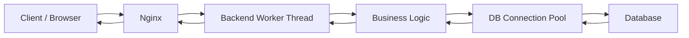

# Single Server Architecture, Bottlenecks and Vertical Scaling

## Goal

Understand how a complete request travels through a single server, what resources a single server has, where bottlenecks occur as traffic increases, and why vertical scaling eventually stops being enough.

> **Technology Agnostic Note:** These concepts apply to any backend service (Spring Boot, Go, Node.js, Python, .NET, Rust, etc.). The runtime changes, but CPU, RAM, threads, connection pools, and networking behave similarly.

---

# 1. Single Server Architecture

A single server can host multiple backend components on the same machine.

Typical components:

- Web Server (Nginx)
- Backend Application
- Redis (optional)
- Database (optional for small deployments)

All run as independent OS processes.

## Complete Request Lifecycle



### Step-by-Step Flow

1. Client sends an HTTP/HTTPS request.
2. Nginx receives the request.
3. Nginx forwards it to the backend application.
4. Backend assigns a worker thread.
5. Business logic executes.
6. Thread borrows a database connection.
7. Database executes queries.
8. Connection returns to the pool.
9. Response returns to the client.

---

# 2. Thread Pool vs Connection Pool

These are different resources.

## Thread Pool

Purpose:

- Executes incoming requests.

Managed by:

- Application runtime/web server.

Example:

- Tomcat worker threads.
- Go goroutines scheduled by the runtime.

If all worker threads are busy:

- New requests wait.

---

## Connection Pool

Purpose:

- Reuse TCP connections to the database.

Managed by:

- Backend application.

Example:

Pool size = 20.

- 20 database queries execute simultaneously.
- Additional requests wait for a free connection.

---

## Difference

| Thread Pool | Connection Pool |
|-------------|-----------------|
| Handles HTTP requests. | Handles database access. |
| Worker thread executes business logic. | Connection executes SQL queries. |
| Limited by CPU and memory. | Limited by database capacity. |

### Important

A thread is **not permanently attached** to one database connection.

A thread borrows a connection only when it needs to execute SQL.

After the query finishes, the connection returns to the pool.

---

# 3. Stateless vs Stateful Application

## Stateless

The server stores no user-specific session data inside its own memory.

Every request contains enough information (JWT, token, request data).

Benefits:

- Any server can handle any request.
- Easy horizontal scaling.

---

## Stateful

Server stores user session in memory.

Example:

User logs in.

Server stores:

```text
SessionID -> User Object
```

inside RAM.

Problem:

If another server receives the next request, it does not know that session.

We'll solve this later using Redis.

---

# 4. Resources Available on a Single Server

Every server has finite resources.

| Resource | Used For |
|----------|----------|
| CPU | Execute threads and application code. |
| RAM | Process memory, Buffer Pool, caches. |
| SSD/Disk | Application files and database storage. |
| Network Bandwidth | Sending/receiving request data. |
| Thread Pool | Concurrent request execution. |
| Connection Pool | Concurrent database operations. |

As traffic increases, one of these becomes the bottleneck.

---

# 5. CPU Bottleneck

Suppose:

- 8 CPU cores.
- 300 worker threads.

Only **8 threads execute simultaneously**.

Remaining threads wait through context switching.

Symptoms:

- High CPU usage.
- Increased response time.
- Queue builds up.

---

# 6. RAM Bottleneck

RAM stores:

- Backend process.
- Heap.
- Thread stacks.
- Redis process.
- Database Buffer Pool.
- OS cache.

If RAM fills:

- OS starts swapping.
- SSD becomes temporary memory.
- Performance drops significantly.

---

# 7. Thread Pool Exhaustion

Example:

Thread pool size = 200.

Traffic:

- 200 active requests.
- 50 new requests arrive.

Behavior:

- New requests wait.
- Eventually timeout if waiting too long.

Increasing thread count is **not always the solution** because CPU is still limited.

---

# 8. Connection Pool Exhaustion

Example:

Pool size = 20.

40 requests execute SQL simultaneously.

Behavior:

- First 20 borrow connections.
- Remaining requests wait.
- Response latency increases.

Connection pools protect the database from too many simultaneous connections.

---

# 9. Network Bandwidth Bottleneck

Bandwidth is finite.

Example:

1 Gbps network interface.

Large uploads/downloads consume bandwidth.

Symptoms:

- Requests become slower.
- File uploads delay API traffic.
- Throughput reaches network limit.

Adding CPU does not increase bandwidth.

---

# 10. Disk I/O Bottleneck

Database eventually reads/writes SSD.

Heavy workloads cause:

- More page reads.
- More dirty page flushes.
- Higher SSD utilization.

Symptoms:

- Slow queries.
- Increased write latency.

---

# 11. How Do We Identify the Bottleneck?

| Symptom | Likely Bottleneck |
|---------|-------------------|
| CPU near 100% | CPU bound. |
| RAM exhausted | Memory bound. |
| Waiting for DB connections | Connection pool exhausted. |
| Slow SSD reads/writes | Disk I/O bottleneck. |
| Network saturated | Bandwidth bottleneck. |
| High request queue | Thread pool exhausted. |

The bottleneck determines the scaling strategy.

---

# 12. Vertical Scaling

Vertical scaling means **making the same server bigger**.

Examples:

- More CPU cores.
- More RAM.
- Faster SSD.
- Higher bandwidth NIC.

Nothing changes in application architecture.

---

## Example

Before:

- 4 CPU cores.
- 8 GB RAM.

After:

- 16 CPU cores.
- 64 GB RAM.

Same application.

Same database.

Same server.

---

# 13. Benefits of Vertical Scaling

- Simple.
- No code changes.
- No distributed complexity.
- Immediate performance improvement.

Good for early-stage applications.

---

# 14. Limitations of Vertical Scaling

A server cannot grow forever.

Limitations:

- Maximum CPU cores.
- Maximum RAM.
- Hardware cost increases.
- Single point of failure remains.

Eventually one machine becomes insufficient.

---

# 15. When Does a Single Server Stop Scaling?

Typical signs:

- CPU constantly saturated.
- Memory constantly full.
- Thread pool always busy.
- Connection pool waits increase.
- Network bandwidth maxed out.
- Traffic continues growing.

Now adding more hardware is no longer enough.

This is the point where we move to **horizontal scaling**.

---

# 16. Vertical vs Horizontal Scaling

| Vertical Scaling | Horizontal Scaling |
|------------------|--------------------|
| Bigger server. | More servers. |
| Increase CPU/RAM. | Add additional machines. |
| Simple architecture. | Distributed architecture. |
| Still one point of failure. | Fault tolerant. |
| Hardware limit exists. | Can scale much further. |

Horizontal scaling is the beginning of distributed systems.

---

# Interview Takeaways

- A single server contains finite CPU, RAM, disk, network bandwidth, thread pool, and database connection pool resources.
- Thread pools handle concurrent requests; connection pools handle concurrent database access.
- Stateless applications are easier to scale horizontally than stateful applications.
- Vertical scaling increases the capacity of one server but does not remove the single point of failure.
- Resource bottlenecks determine when an application must move from one server to multiple servers.