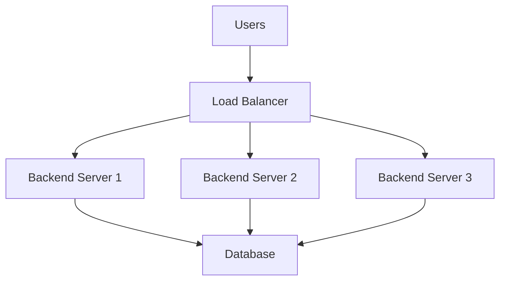

# Horizontal Scaling and Load Balancer

## Goal

Understand why a single server eventually becomes insufficient, how multiple backend servers work together, what a load balancer does, and how requests are distributed across servers.

> **Technology Agnostic Note:** Horizontal scaling is an infrastructure concept. Whether your backend is written in Java, Go, Node.js, Python, .NET, or Rust, the architecture remains the same.

---

# 1. When Does Distributed Systems Actually Begin?

A distributed system begins when **one application starts running on multiple machines** instead of a single machine.

Previously we had:

- One server.
- One backend process.
- One database.

Now we have:

- Multiple backend servers.
- Same application running on each server.
- Users can be served by any server.

---

# 2. Why Isn't One Server Enough?

Suppose our application becomes popular.

### Single Server Capacity

| Resource | Limit |
|----------|-------|
| CPU | Limited number of cores. |
| RAM | Limited memory. |
| Thread Pool | Limited worker threads. |
| Connection Pool | Limited DB connections. |
| Network Bandwidth | Limited throughput. |

Eventually requests exceed server capacity.

Symptoms:

- High latency.
- Request queue grows.
- Timeouts.
- CPU remains near 100%.

Adding more CPU/RAM helps only temporarily (vertical scaling).

---

# 3. What is Horizontal Scaling?

Horizontal scaling means **adding more servers** running the same application.

Instead of upgrading one server:

- Server A
- Server B
- Server C

All serve requests simultaneously.

### Before Horizontal Scaling

```text
Users
   │
   ▼
Backend Server
   │
   ▼
Database
```

Everything depends on one machine.

### After Horizontal Scaling



Now traffic is shared across servers.

---

# 4. What Does "Same Application on Multiple Servers" Mean?

Each server runs **its own process**.

Example:

| Server | Running Process |
|--------|-----------------|
| Server A | Orders Service |
| Server B | Orders Service |
| Server C | Orders Service |

The code is identical.

Each process has:

- Its own RAM.
- Its own threads.
- Its own connection pool.
- Its own local cache.

Nothing in RAM is shared automatically.

---

# 5. Why Can't Users Directly Choose a Server?

Imagine one million users.

Questions arise:

- Which server should User A hit?
- What if Server B is overloaded?
- What if Server C crashes?

Clients should not make these decisions.

A dedicated component is needed.

This component is the **Load Balancer**.

---

# 6. What is a Load Balancer?

A load balancer is a server (or managed service) that sits **in front of backend servers**.

Its job is:

- Receive every incoming request.
- Select one healthy backend server.
- Forward the request.
- Return the response to the client.

The client only knows **one public address**.

---

# 7. Why Do We Need a Load Balancer?

Without a load balancer:

- Clients need to know every server IP.
- Traffic distribution becomes impossible.
- Failed servers still receive requests.

With a load balancer:

- One public endpoint.
- Automatic request distribution.
- Health monitoring.
- Failover support.

---

# 8. Load Balancer Responsibilities

A load balancer does much more than forwarding traffic.

| Responsibility | Purpose |
|---------------|---------|
| Request Routing | Send request to one backend. |
| Traffic Distribution | Spread requests across servers. |
| Health Checks | Detect failed servers. |
| Failover | Stop sending traffic to unhealthy servers. |
| SSL Termination | Handle HTTPS certificates. |
| Rate Limiting (optional) | Protect backend from excessive traffic. |

We'll study each feature later.

---

# 9. How Does a Request Flow Now?

1. Browser sends request to one public URL.
2. DNS resolves the load balancer IP.
3. Load balancer receives request.
4. Chooses one backend server.
5. Backend executes business logic.
6. Backend queries the database.
7. Response returns through the load balancer.

The client never knows which backend server handled the request.

---

# 10. Is the Database Also Replicated?

**Not yet.**

At this stage:

- Multiple backend servers.
- One shared database.

Why?

We first scale the application layer.

Database scaling comes later because it introduces different consistency challenges.

---

# 11. What Changes After Horizontal Scaling?

### Each Server Has Its Own Resources

| Resource | Shared? |
|----------|---------|
| CPU | ❌ No |
| RAM | ❌ No |
| Thread Pool | ❌ No |
| Connection Pool | ❌ No |
| Local Cache | ❌ No |
| Database | ✅ Shared |

This is the first important distributed systems concept.

Servers share **nothing in memory**.

---

# 12. Benefits of Horizontal Scaling

- More concurrent requests.
- Better CPU utilization across machines.
- Fault tolerance.
- Easier incremental scaling.
- Can handle much larger traffic than one machine.

Example:

3 servers with capacity for 100 requests/sec each.

Total capacity becomes roughly **300 requests/sec**.

---

# 13. New Problems Introduced

Horizontal scaling solves one problem but creates new ones.

| New Problem | We'll Solve In |
|-------------|----------------|
| User session exists on one server only. | Stateless Services & Sessions |
| Local cache differs on every server. | Redis Distributed Cache |
| Database becomes bottleneck. | Database Replication |
| Duplicate processing across servers. | Distributed Locks & Idempotency |

Distributed systems are mostly about solving these new problems.

---

# Interview Takeaways

- Horizontal scaling means adding more servers running the same application.
- Every backend server is an independent machine with its own CPU, RAM, threads, and connection pool.
- A load balancer provides one public endpoint and distributes requests to healthy backend servers.
- Backend servers usually share a database initially, but they do **not** share RAM or local memory.
- Horizontal scaling improves throughput and availability but introduces state-sharing and consistency challenges.