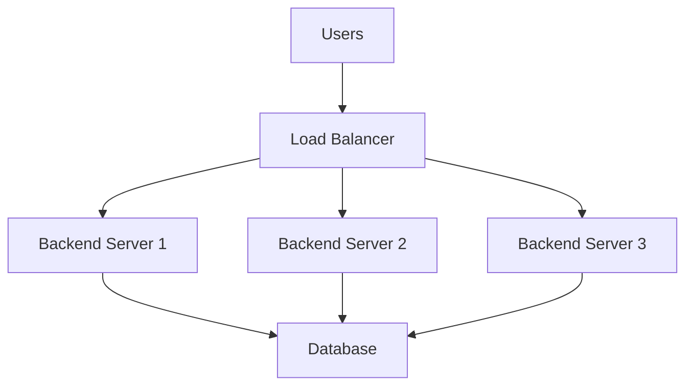
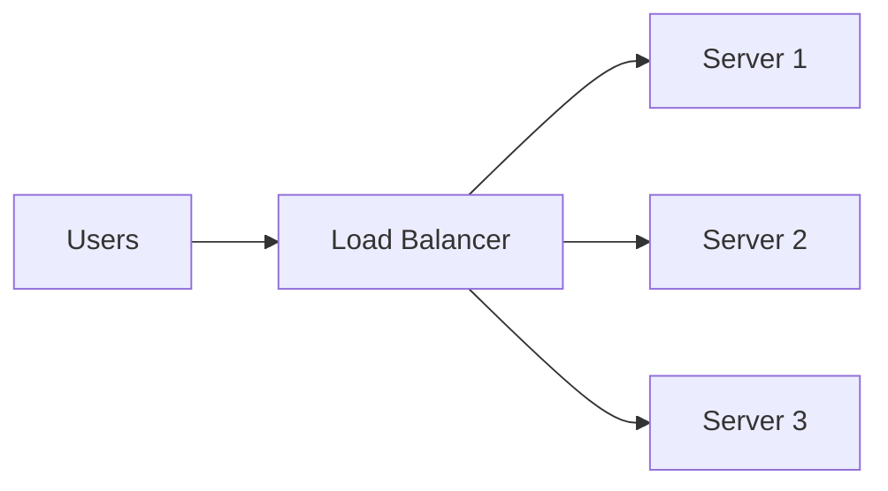

# Horizontal Scaling and Load Balancer

## Goal

Understand why a single server eventually becomes insufficient, how multiple backend servers work together, what a load balancer does, and how requests are distributed across servers.

> **Technology Agnostic Note:** Horizontal scaling is an infrastructure concept. Whether your backend is written in Java, Go, Node.js, Python, .NET, or Rust, the architecture remains the same.

---

# 1. When Does Distributed Systems Actually Begin?

A distributed system begins when **one application starts running on multiple machines** instead of a single machine.

Previously we had:

- One server.
- One backend process.
- One database.

Now we have:

- Multiple backend servers.
- Same application running on each server.
- Users can be served by any server.

---

# 2. Why Isn't One Server Enough?

Suppose our application becomes popular.

### Single Server Capacity

| Resource | Limit |
|----------|-------|
| CPU | Limited number of cores. |
| RAM | Limited memory. |
| Thread Pool | Limited worker threads. |
| Connection Pool | Limited DB connections. |
| Network Bandwidth | Limited throughput. |

Eventually requests exceed server capacity.

Symptoms:

- High latency.
- Request queue grows.
- Timeouts.
- CPU remains near 100%.

Adding more CPU/RAM helps only temporarily (vertical scaling).

---

# 3. What is Horizontal Scaling?

Horizontal scaling means **adding more servers** running the same application.

Instead of upgrading one server:

- Server A
- Server B
- Server C

All serve requests simultaneously.

### Before Horizontal Scaling

```text
Users
   │
   ▼
Backend Server
   │
   ▼
Database
```

Everything depends on one machine.

### After Horizontal Scaling



Now traffic is shared across servers.

---

# 4. What Does "Same Application on Multiple Servers" Mean?

Each server runs **its own process**.

Example:

| Server | Running Process |
|--------|-----------------|
| Server A | Orders Service |
| Server B | Orders Service |
| Server C | Orders Service |

The code is identical.

Each process has:

- Its own RAM.
- Its own threads.
- Its own connection pool.
- Its own local cache.

Nothing in RAM is shared automatically.

---

# 5. Why Can't Users Directly Choose a Server?

Imagine one million users.

Questions arise:

- Which server should User A hit?
- What if Server B is overloaded?
- What if Server C crashes?

Clients should not make these decisions.

A dedicated component is needed.

This component is the **Load Balancer**.

---

# 6. What is a Load Balancer?

A load balancer is a server (or managed service) that sits **in front of backend servers**.

Its job is:

- Receive every incoming request.
- Select one healthy backend server.
- Forward the request.
- Return the response to the client.

The client only knows **one public address**.

---

# 7. Why Do We Need a Load Balancer?

Without a load balancer:

- Clients need to know every server IP.
- Traffic distribution becomes impossible.
- Failed servers still receive requests.

With a load balancer:

- One public endpoint.
- Automatic request distribution.
- Health monitoring.
- Failover support.

---

# 8. Load Balancer Responsibilities

A load balancer does much more than forwarding traffic.

| Responsibility | Purpose |
|---------------|---------|
| Request Routing | Send request to one backend. |
| Traffic Distribution | Spread requests across servers. |
| Health Checks | Detect failed servers. |
| Failover | Stop sending traffic to unhealthy servers. |
| SSL Termination | Handle HTTPS certificates. |
| Rate Limiting (optional) | Protect backend from excessive traffic. |

We'll study each feature later.

---

# 9. How Does a Request Flow Now?

1. Browser sends request to one public URL.
2. DNS resolves the load balancer IP.
3. Load balancer receives request.
4. Chooses one backend server.
5. Backend executes business logic.
6. Backend queries the database.
7. Response returns through the load balancer.

The client never knows which backend server handled the request.

---

# 10. Is the Database Also Replicated?

**Not yet.**

At this stage:

- Multiple backend servers.
- One shared database.

Why?

We first scale the application layer.

Database scaling comes later because it introduces different consistency challenges.

---

# 11. What Changes After Horizontal Scaling?

### Each Server Has Its Own Resources

| Resource | Shared? |
|----------|---------|
| CPU | ❌ No |
| RAM | ❌ No |
| Thread Pool | ❌ No |
| Connection Pool | ❌ No |
| Local Cache | ❌ No |
| Database | ✅ Shared |

This is the first important distributed systems concept.

Servers share **nothing in memory**.

---

# 12. Benefits of Horizontal Scaling

- More concurrent requests.
- Better CPU utilization across machines.
- Fault tolerance.
- Easier incremental scaling.
- Can handle much larger traffic than one machine.

Example:

3 servers with capacity for 100 requests/sec each.

Total capacity becomes roughly **300 requests/sec**.

---

# 13. New Problems Introduced

Horizontal scaling solves one problem but creates new ones.

| New Problem | We'll Solve In |
|-------------|----------------|
| User session exists on one server only. | Stateless Services & Sessions |
| Local cache differs on every server. | Redis Distributed Cache |
| Database becomes bottleneck. | Database Replication |
| Duplicate processing across servers. | Distributed Locks & Idempotency |

Distributed systems are mostly about solving these new problems.

---

# Interview Takeaways

- Horizontal scaling means adding more servers running the same application.
- Every backend server is an independent machine with its own CPU, RAM, threads, and connection pool.
- A load balancer provides one public endpoint and distributes requests to healthy backend servers.
- Backend servers usually share a database initially, but they do **not** share RAM or local memory.
- Horizontal scaling improves throughput and availability but introduces state-sharing and consistency challenges.
- Local cache is commonly used in production for cacheable data (config, product catalog, feature flags, etc.), but not for user sessions in horizontally scaled systems.


# Horizontal Scaling and Load Balancer (Part 2)

## Goal

Understand how a load balancer chooses backend servers, detects failures, and routes requests in a distributed system.

---

# 14. What Exactly is a Load Balancer?

A load balancer is a **traffic manager**.

It sits between clients and backend servers and decides **which backend server should handle each request**.



The client only knows the load balancer's public IP or domain.

---

# 15. Is the Load Balancer Also a Server?

**Yes.**

A load balancer is itself a machine or managed cloud service.

Examples:

| Self Managed | Cloud Managed |
|--------------|---------------|
| Nginx | AWS ALB |
| HAProxy | AWS NLB |
| Envoy | GCP Load Balancer |

It receives requests just like any backend server.

---

# 16. How Does the Load Balancer Know Which Server to Send a Request To?

It maintains a list of backend servers.

Example:

| Server | Status |
|--------|--------|
| Server A | Healthy |
| Server B | Healthy |
| Server C | Healthy |

For every incoming request it picks one healthy server using a routing algorithm.

---

# 17. Round Robin (Most Common Algorithm)

Requests are distributed one after another.

| Request | Server |
|---------|--------|
| R1 | Server A |
| R2 | Server B |
| R3 | Server C |
| R4 | Server A |
| R5 | Server B |

Every server gets approximately equal traffic.

### When is it useful?

Servers have similar hardware and similar capacity.

---

# 18. Least Connections

Instead of rotating equally, send traffic to the server currently handling the fewest active requests.

Example:

| Server | Active Requests |
|--------|-----------------|
| A | 80 |
| B | 15 |
| C | 40 |

New request goes to **Server B**.

### Useful for

Requests with very different execution times.

---

# 19. Weighted Round Robin

Not all servers are equally powerful.

Example:

| Server | Weight |
|--------|--------|
| A | 4 |
| B | 2 |
| C | 1 |

Traffic distribution:

- Server A receives more requests.
- Server C receives fewer requests.

Useful during gradual upgrades or mixed hardware clusters.

---

# 20. IP Hash

The load balancer hashes the client's IP address.

Result:

Same client IP usually reaches the same backend server.

### Why use it?

Useful when applications keep session state locally.

### Drawback

If that server fails, the client is routed elsewhere and the session is lost.

---

# 21. Which Algorithm is Most Common?

| Algorithm | Typical Usage |
|-----------|---------------|
| Round Robin | Stateless REST APIs. |
| Least Connections | Long-running requests. |
| Weighted Round Robin | Servers with different capacities. |
| IP Hash | Sticky session use cases. |

Most modern stateless APIs use **Round Robin** or **Least Connections**.

---

# 22. What Happens if a Backend Server Crashes?

Suppose Server B crashes.

Without health checks:

- Load balancer still forwards requests.
- Users receive errors.

Need automatic detection.

---

# 23. Health Checks

The load balancer periodically checks every backend server.

Example:

```text
GET /health
```

Response:

```http
200 OK
```

means healthy.

### Example Table

| Server | Health Endpoint |
|--------|-----------------|
| A | 200 OK |
| B | Timeout |
| C | 200 OK |

Server B is marked unhealthy.

---

# 24. What Happens After a Health Check Fails?

Load balancer removes that server from routing.

Before:

A, B, C

After failure:

A, C

Users never notice unless capacity becomes insufficient.

This is called **Failover**.

---

# 25. What is Failover?

Failover means automatically routing traffic away from unhealthy servers.

Steps:

1. Health check fails.
2. Server removed.
3. New requests go to remaining healthy servers.

No manual intervention is required.

---

# 26. Does the Load Balancer Wait Forever for a Server?

No.

Every request has a timeout.

Example:

- Backend doesn't respond within 5 seconds.
- Load balancer returns an error or retries (depending on configuration).

Timeouts prevent requests from hanging forever.

---

# 27. L4 vs L7 Load Balancer

## Layer 4 (Transport Layer)

Works using:

- IP.
- TCP.
- UDP.

Routes traffic without looking inside HTTP requests.

Examples:

- AWS Network Load Balancer.
- HAProxy TCP mode.

Fastest option.

---

## Layer 7 (Application Layer)

Understands HTTP.

Can route using:

- URL path.
- Headers.
- Cookies.
- Hostname.

Example:

```text
/api/orders  → Orders Service
/api/users   → User Service
```

Examples:

- Nginx.
- Envoy.
- AWS Application Load Balancer.

---

# 28. Reverse Proxy vs Load Balancer

This causes confusion.

## Reverse Proxy

Receives requests and forwards them to backend services.

Example:

- Nginx forwarding traffic to one backend server.

## Load Balancer

Also acts as a reverse proxy, but forwards requests across **multiple backend servers**.

### Simple Difference

| Reverse Proxy | Load Balancer |
|---------------|---------------|
| One or more backend services. | Multiple backend servers of the same service. |
| Mainly request forwarding. | Request forwarding + traffic distribution + health checks. |

Many tools (Nginx, Envoy) can do **both** roles.

---

# 29. Is Nginx Both?

**Yes.**

Nginx can:

- Serve static files.
- Reverse proxy requests.
- SSL termination.
- Load balance requests across backend servers.

The configuration determines its role.

---

# 30. What Problems Have We Solved So Far?

We solved:

- One server overload.
- Automatic traffic distribution.
- Server failure handling.
- One public endpoint for clients.

### But New Problems Appear

| New Problem | Next Section |
|-------------|--------------|
| User logs into Server A, next request goes to Server B. | Stateless Services & Sessions |
| Cache exists only on one server. | Redis Distributed Cache |
| Database becomes overloaded. | Database Replication |

---

# Interview Takeaways

- A load balancer is a traffic manager sitting in front of backend servers.
- It distributes requests using algorithms like Round Robin, Least Connections, Weighted Round Robin, or IP Hash.
- Health checks continuously monitor backend servers.
- Failover removes unhealthy servers from routing automatically.
- Layer 4 load balancers route TCP/UDP traffic, while Layer 7 load balancers understand HTTP requests.
- Nginx can act as both a reverse proxy and a load balancer.