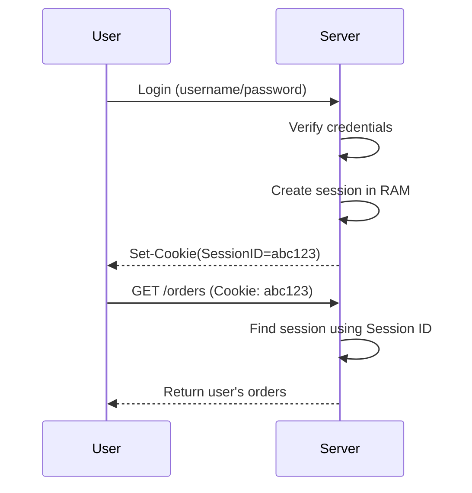
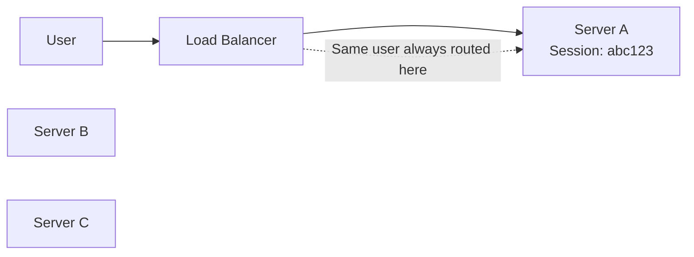
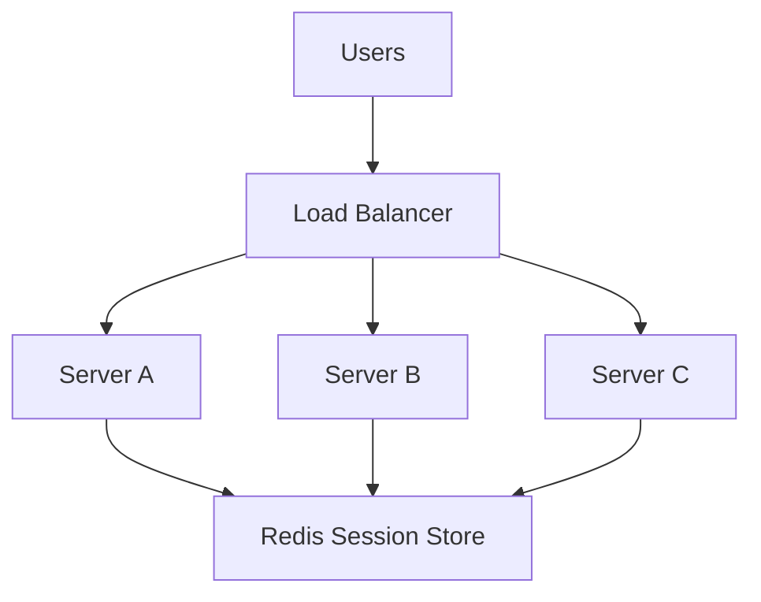

# Stateless Services and Session Management

## Goal

Understand what **state** means in a backend application, how user sessions work on a single server, why sessions break after horizontal scaling, and why distributed systems prefer stateless services.

> **Technology Agnostic Note:** The concepts apply to Spring Boot, Go, Node.js, Python, .NET, Rust, or any backend framework. The mechanism for storing sessions differs, but the architecture is the same.

---

# 1. What is State?

**State** is any information that must be remembered between two requests.

### Examples of State

| Example | Is it State? |
|----------|--------------|
| User is logged in. | ✅ Yes |
| Shopping cart contents. | ✅ Yes |
| Current OTP verification status. | ✅ Yes |
| Product catalog loaded from DB. | ✅ Cached state |
| CPU usage. | ❌ Runtime metric |

If the server needs to remember something after one request finishes, that information is **state**.

---

# 2. HTTP is Stateless

HTTP itself does **not remember previous requests**.

Example:

### Request 1

```http
POST /login
```

Server authenticates the user.

### Request 2

```http
GET /orders
```

HTTP does not automatically know this is the same user.

Every request is independent unless the application maintains state.

---

# 3. What is a Session?

A **session** is server-side state associated with one user.

When a user logs in:

1. Server authenticates credentials.
2. Server creates a session.
3. Server generates a unique Session ID.
4. Session ID is sent back to the client (usually as a cookie).

### Example

| Session ID | User Data |
|------------|-----------|
| abc123 | userId=5, role=USER |
| xyz789 | userId=8, role=ADMIN |

The client stores only the Session ID.

The server stores the actual session data.

---

# 4. How Sessions Work on a Single Server

### Login Flow



Everything works because every request reaches the same server.

---

# 5. Where is the Session Stored?

For a single server, sessions are commonly stored in **server memory (RAM)**.

Internal representation is conceptually similar to:

```text
SessionID
   │
   ▼
User Session Object
```

Example:

| Session ID | Session Object |
|------------|----------------|
| abc123 | userId=5, expires=10:30 PM |
| xyz789 | userId=8, expires=11:15 PM |

The backend framework manages this storage automatically.

---

# 6. Is Session the Same as Local Cache?

**A session is one use of local cache, but local cache is broader.**

| Local Cache | Session |
|-------------|---------|
| Stores frequently used application data. | Stores user-specific login state. |
| Product cache, configs, feature flags. | Logged-in user information. |
| May exist without authentication. | Exists for authenticated users. |

Every session stored in RAM is local cache, but not every local cache entry is a session.

---

# 7. What Happens if the Server Restarts?

Suppose sessions live in RAM.

Server restarts.

RAM is cleared.

Result:

| Before Restart | After Restart |
|----------------|---------------|
| Session exists. | Session lost. |
| User authenticated. | User logged out. |

Local in-memory sessions disappear after restart.

---

# 8. Why is This Fine for a Single Server?

Because:

- Only one server exists.
- Every request reaches that server.
- Session is always available while the server is alive.

For small applications, this approach is simple and fast.

---

# 9. What Changes After Horizontal Scaling?

Now we have multiple backend servers.

```text
Users
   │
Load Balancer
   │
Server A   Server B   Server C
```

Each server has **its own RAM**.

That means:

| Server | Session Storage |
|--------|-----------------|
| Server A | Local RAM |
| Server B | Local RAM |
| Server C | Local RAM |

These memories are completely independent.

---

# 10. The Session Problem

Example:

### Login Request

Load balancer sends login request to **Server A**.

Server A creates:

| Session ID | User |
|------------|------|
| abc123 | User 5 |

Now user calls another API.

Load balancer sends request to **Server B**.

Server B searches for:

```text
abc123
```

Result:

**Session not found.**

Server B never created that session.

User appears logged out.

---

# 11. Why Can't Servers Share RAM?

Each backend server is a different machine (or different process).

Each machine has:

- Independent CPU.
- Independent RAM.
- Independent thread pool.
- Independent local cache.

RAM is **not automatically shared over the network**.

This is the first major distributed systems challenge.

---

# 12. What Problem Did Horizontal Scaling Introduce?

Horizontal scaling improved throughput.

But it introduced **distributed state**.

Now user state must be available regardless of which backend server receives the request.

This is the motivation for the next solutions.

---

# Interview Takeaways

- State is information that must survive across multiple requests.
- HTTP is stateless; sessions make user authentication stateful.
- In a single-server application, sessions are commonly stored in server RAM.
- Local cache includes sessions but also many other cached objects.
- Local RAM is private to one server, so horizontal scaling breaks in-memory sessions.
- The session problem is the first major consistency challenge introduced by multiple backend servers.


# Stateless Services and Session Management (Part 2)

## Goal

Understand how distributed systems solve the session problem using Sticky Sessions, Redis, and JWT, and learn which approach is used in production systems.

---

# 13. Solution 1 — Sticky Sessions

The simplest solution is to always send the same user to the same backend server.

### How it works

1. User logs in.
2. Load balancer routes login request to **Server A**.
3. Server A creates the session in its RAM.
4. Load balancer remembers that this user should always go to Server A.



The user's future requests always reach Server A.

---

# 14. How Does the Load Balancer Remember?

The load balancer creates an **affinity** between the client and a backend server.

Common techniques:

| Technique | Example |
|-----------|---------|
| Cookie-based affinity | Load balancer sets its own cookie. |
| IP Hash | Same client IP hashes to same server. |
| Session Cookie Hash | Session ID determines backend server. |

The backend application does not need to know this logic.

---

# 15. Why Sticky Sessions Are Attractive

Advantages:

- Very easy to implement.
- Existing in-memory sessions continue working.
- No extra infrastructure required.

Works well for small deployments.

---

# 16. Problems with Sticky Sessions

Sticky sessions create several distributed system problems.

### Problem 1 — Server Failure

Session exists only on Server A.

Server A crashes.

Result:

- Session disappears.
- User logs in again.

### Problem 2 — Uneven Load

Suppose Server A has 50,000 active users.

Server B has only 5,000.

Sticky routing prevents balancing traffic evenly.

### Problem 3 — Scaling

Adding a new server does not move existing sessions automatically.

Some servers remain overloaded.

---

# 17. Why Large Systems Avoid Sticky Sessions

Sticky sessions reduce one benefit of horizontal scaling.

Instead of "any server can serve any request",

it becomes

"this user must reach one specific server."

That limits flexibility and failover.

---

# 18. Solution 2 — Shared Session Store (Redis)

Instead of storing sessions in server RAM, store them in **one shared data store**.

### Architecture



Every server reads and writes sessions from Redis.

---

# 19. Login Flow with Redis

### Login

1. User logs in through Server A.
2. Server A authenticates credentials.
3. Session stored in Redis.
4. Redis returns success.
5. Session ID sent to client.

### Next Request

1. Load balancer sends request to Server B.
2. Server B reads Session ID.
3. Fetches session from Redis.
4. User remains authenticated.

Now **any server** can serve the request.

---

# 20. What Does Redis Store?

Conceptually:

| Session ID | Session Data |
|------------|--------------|
| abc123 | userId=5, role=USER |
| xyz789 | userId=8, role=ADMIN |

Redis stores these entries in memory.

Each session usually has an expiration time (TTL).

---

# 21. What Happens if a Backend Server Restarts?

Suppose Server B restarts.

Result:

- Backend RAM is cleared.
- Session still exists in Redis.
- User continues without logging in again.

This is a huge improvement over local sessions.

---

# 22. Why Is Redis Better Than Local Sessions?

| Local Session | Redis Session |
|---------------|---------------|
| Stored in one server's RAM. | Stored in shared Redis. |
| Lost on server restart. | Survives backend restart. |
| Requires sticky routing. | Any server can serve the request. |
| Difficult horizontal scaling. | Easy horizontal scaling. |

---

# 23. Does Redis Become a Single Point of Failure?

Potentially yes.

Production systems usually run:

- Redis primary.
- Redis replicas.
- Automatic failover (Redis Sentinel/Cluster).

We'll study Redis architecture in the next section.

---

# 24. Solution 3 — JWT (JSON Web Token)

JWT takes a completely different approach.

**No session is stored on the backend.**

### Login

1. User logs in.
2. Backend creates a signed JWT.
3. JWT sent to client.
4. Client stores the token.

Every future request includes the token.

---

# 25. JWT Request Flow

```text
User Login
      │
      ▼
Backend creates JWT
      │
      ▼
Client stores JWT
      │
      ▼
Every request sends JWT
      │
      ▼
Any backend verifies signature
```

No Redis lookup is required.

---

# 26. What Does a JWT Contain?

Example payload:

```json
{
  "userId": 5,
  "role": "USER",
  "exp": 1760000000
}
```

It contains:

- User identity.
- Claims.
- Expiration timestamp.

The token is digitally signed.

---

# 27. Why Can't Users Modify a JWT?

JWT is signed using a server secret or private key.

If payload changes:

- Signature becomes invalid.
- Backend rejects the token.

The client can read the payload but cannot forge a valid signature.

---

# 28. JWT vs Session

| Session | JWT |
|---------|-----|
| State stored on server. | State stored in client token. |
| Requires lookup (RAM/Redis). | No lookup required for authentication. |
| Easy logout by deleting session. | Logout is harder until token expires. |
| Can revoke immediately. | Requires blacklist/short expiry for revocation. |

---

# 29. Which Approach is Used in Production?

There is no single answer.

### Small Applications

- Local sessions.

### Medium Applications

- Redis sessions.

### Large Microservices

- JWT access tokens.
- Redis for refresh tokens or session revocation.
- Hybrid authentication is very common.

---

# 30. Redis vs JWT — When to Use Which?

| Use Case | Preferred Approach |
|----------|--------------------|
| Web application with server-managed login | Redis Sessions |
| Mobile APIs / Microservices | JWT |
| Immediate logout everywhere | Redis Session or JWT blacklist |
| Stateless REST APIs | JWT |
| Need shared login across servers | Redis or JWT |

---

# 31. What Did We Learn?

Horizontal scaling introduced distributed state.

We solved it in three stages:

1. Sticky Sessions — simplest but limited.
2. Redis Session Store — shared state across servers.
3. JWT — remove server-side session state entirely.

This is the transition from **stateful servers** to **stateless distributed services**.

---

# Interview Takeaways

- Sticky Sessions keep users on one backend server but reduce flexibility and failover.
- Redis allows all backend servers to share session state.
- JWT stores authentication state inside a signed client token, making backend servers stateless.
- Stateless services are easier to scale horizontally because any server can handle any request.
- Large production systems commonly use a hybrid approach: JWT for authentication and Redis for refresh tokens or session management.