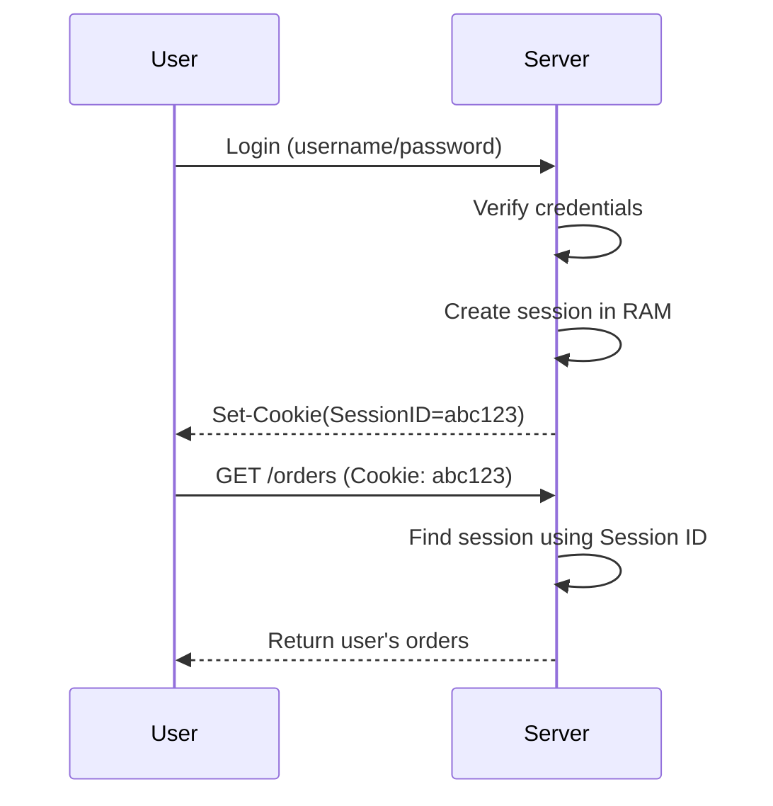

# Stateless Services and Session Management

## Goal

Understand what **state** means in a backend application, how user sessions work on a single server, why sessions break after horizontal scaling, and why distributed systems prefer stateless services.

> **Technology Agnostic Note:** The concepts apply to Spring Boot, Go, Node.js, Python, .NET, Rust, or any backend framework. The mechanism for storing sessions differs, but the architecture is the same.

---

# 1. What is State?

**State** is any information that must be remembered between two requests.

### Examples of State

| Example | Is it State? |
|----------|--------------|
| User is logged in. | ✅ Yes |
| Shopping cart contents. | ✅ Yes |
| Current OTP verification status. | ✅ Yes |
| Product catalog loaded from DB. | ✅ Cached state |
| CPU usage. | ❌ Runtime metric |

If the server needs to remember something after one request finishes, that information is **state**.

---

# 2. HTTP is Stateless

HTTP itself does **not remember previous requests**.

Example:

### Request 1

```http
POST /login
```

Server authenticates the user.

### Request 2

```http
GET /orders
```

HTTP does not automatically know this is the same user.

Every request is independent unless the application maintains state.

---

# 3. What is a Session?

A **session** is server-side state associated with one user.

When a user logs in:

1. Server authenticates credentials.
2. Server creates a session.
3. Server generates a unique Session ID.
4. Session ID is sent back to the client (usually as a cookie).

### Example

| Session ID | User Data |
|------------|-----------|
| abc123 | userId=5, role=USER |
| xyz789 | userId=8, role=ADMIN |

The client stores only the Session ID.

The server stores the actual session data.

---

# 4. How Sessions Work on a Single Server

### Login Flow



Everything works because every request reaches the same server.

---

# 5. Where is the Session Stored?

For a single server, sessions are commonly stored in **server memory (RAM)**.

Internal representation is conceptually similar to:

```text
SessionID
   │
   ▼
User Session Object
```

Example:

| Session ID | Session Object |
|------------|----------------|
| abc123 | userId=5, expires=10:30 PM |
| xyz789 | userId=8, expires=11:15 PM |

The backend framework manages this storage automatically.

---

# 6. Is Session the Same as Local Cache?

**A session is one use of local cache, but local cache is broader.**

| Local Cache | Session |
|-------------|---------|
| Stores frequently used application data. | Stores user-specific login state. |
| Product cache, configs, feature flags. | Logged-in user information. |
| May exist without authentication. | Exists for authenticated users. |

Every session stored in RAM is local cache, but not every local cache entry is a session.

---

# 7. What Happens if the Server Restarts?

Suppose sessions live in RAM.

Server restarts.

RAM is cleared.

Result:

| Before Restart | After Restart |
|----------------|---------------|
| Session exists. | Session lost. |
| User authenticated. | User logged out. |

Local in-memory sessions disappear after restart.

---

# 8. Why is This Fine for a Single Server?

Because:

- Only one server exists.
- Every request reaches that server.
- Session is always available while the server is alive.

For small applications, this approach is simple and fast.

---

# 9. What Changes After Horizontal Scaling?

Now we have multiple backend servers.

```text
Users
   │
Load Balancer
   │
Server A   Server B   Server C
```

Each server has **its own RAM**.

That means:

| Server | Session Storage |
|--------|-----------------|
| Server A | Local RAM |
| Server B | Local RAM |
| Server C | Local RAM |

These memories are completely independent.

---

# 10. The Session Problem

Example:

### Login Request

Load balancer sends login request to **Server A**.

Server A creates:

| Session ID | User |
|------------|------|
| abc123 | User 5 |

Now user calls another API.

Load balancer sends request to **Server B**.

Server B searches for:

```text
abc123
```

Result:

**Session not found.**

Server B never created that session.

User appears logged out.

---

# 11. Why Can't Servers Share RAM?

Each backend server is a different machine (or different process).

Each machine has:

- Independent CPU.
- Independent RAM.
- Independent thread pool.
- Independent local cache.

RAM is **not automatically shared over the network**.

This is the first major distributed systems challenge.

---

# 12. What Problem Did Horizontal Scaling Introduce?

Horizontal scaling improved throughput.

But it introduced **distributed state**.

Now user state must be available regardless of which backend server receives the request.

This is the motivation for the next solutions.

---

# Interview Takeaways

- State is information that must survive across multiple requests.
- HTTP is stateless; sessions make user authentication stateful.
- In a single-server application, sessions are commonly stored in server RAM.
- Local cache includes sessions but also many other cached objects.
- Local RAM is private to one server, so horizontal scaling breaks in-memory sessions.
- The session problem is the first major consistency challenge introduced by multiple backend servers.