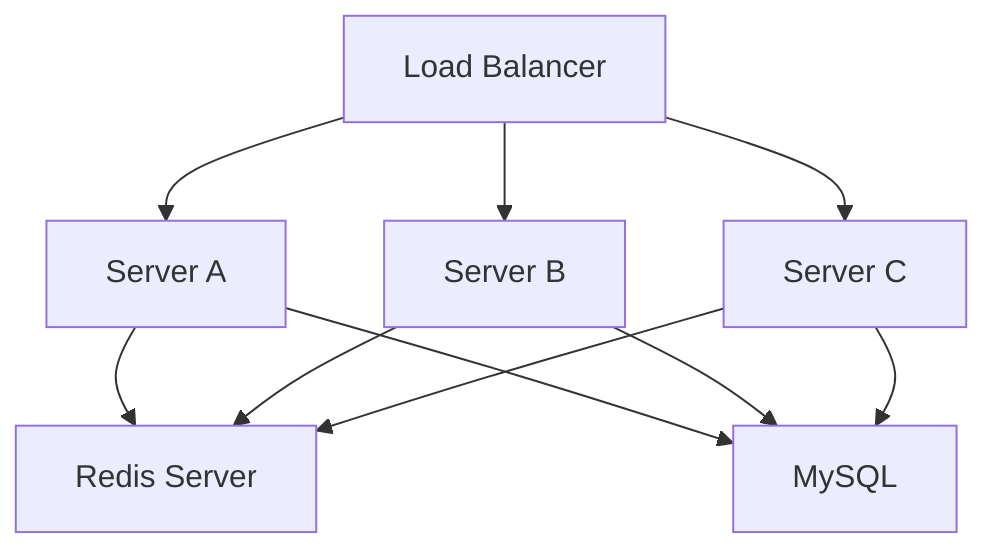

# Redis as a Distributed Cache (Part 1)

## Goal

Understand what Redis is, why distributed systems need it, how it works internally at a high level, and how it becomes a shared cache for multiple backend servers.

> **Technology Agnostic Note:** Redis is an independent in-memory database. Every backend technology (Java, Go, Node.js, Python, .NET, Rust, etc.) connects to Redis over TCP.

---

# 1. Why Do We Need Redis?

After horizontal scaling, we have multiple backend servers.

Each server has its own RAM.

```text
Server A RAM  ❌ Not shared
Server B RAM  ❌ Not shared
Server C RAM  ❌ Not shared
```

Problems:

- Sessions disappear on another server.
- Local cache is different on every server.
- Every server repeatedly queries the database for the same data.

We need **one shared memory system**.

Redis solves this.

---

# 2. What is Redis?

Redis is an **in-memory key-value database**.

It stores data primarily in RAM instead of SSD.

| MySQL | Redis |
|-------|-------|
| Table → Rows → Columns | Key → Value |
| Optimized for durable storage. | Optimized for extremely fast access. |
| Milliseconds. | Usually sub-millisecond. |

Think of Redis as a **shared memory server** that every backend server can access.

---

# 3. Where Does Redis Run?

Redis is a separate process.

It may run:

- On the same machine.
- On another server.
- As a managed cloud service.

Example architecture:



All backend servers connect to the **same Redis instance**.

---

# 4. How Does a Backend Connect to Redis?

The backend opens TCP connections to Redis.

Just like MySQL:

- Redis has its own port.
- Backend maintains a connection pool.
- Commands are sent over TCP.

Default Redis port:

| Service | Port |
|----------|------|
| Redis | **6379** |

---

# 5. What is a Key-Value Store?

Redis stores everything as:

```text
Key  -> Value
```

Examples:

| Key | Value |
|-----|-------|
| `session:abc123` | User session object |
| `product:101` | Product JSON |
| `cart:user5` | Shopping cart |
| `otp:9876543210` | OTP code |

Keys are strings.

Values can be many Redis data structures.

---

# 6. Why is Redis So Fast?

Redis stores data in RAM.

RAM access is much faster than SSD.

Typical flow:

Without Redis:

```text
Backend
   │
Database (SSD-backed)
```

With Redis:

```text
Backend
   │
 Redis (RAM)
   │
Database
```

Most reads avoid the database completely.

---

# 7. Redis is a Shared Cache

Suppose Server A loads product information.

Without Redis:

- Server A queries DB.
- Server B queries DB again.
- Server C queries DB again.

Three database queries.

With Redis:

1. First request queries DB.
2. Data stored in Redis.
3. Every server reads from Redis.

Database load decreases dramatically.

---

# 8. What is Caching?

Caching means storing frequently accessed data closer to the application.

Example:

```sql
SELECT * FROM products WHERE id=101;
```

Instead of executing this every time:

Store result in Redis.

Next requests return cached value.

---

# 9. Cache Read Flow

### Cache Hit

1. Backend asks Redis.
2. Redis has the value.
3. Response returned immediately.

Database is never touched.

### Cache Miss

1. Backend asks Redis.
2. Redis does not have the value.
3. Backend queries MySQL.
4. Result stored in Redis.
5. Response returned.

This is called **Cache-Aside Pattern**.

---

# 10. Cache-Aside Pattern (Most Common)

Step-by-step:

1. Read from Redis.
2. If key exists → Return it.
3. If key doesn't exist → Read DB.
4. Save result in Redis.
5. Return result.

Example:

```text
Redis MISS
      │
      ▼
MySQL
      │
      ▼
Save in Redis
      │
      ▼
Return to User
```

Most production applications use this pattern.

---

# 11. What Can We Cache?

Good candidates:

| Data | Cache? |
|------|--------|
| Product details | ✅ Yes |
| Restaurant details | ✅ Yes |
| Feature flags | ✅ Yes |
| Currency rates | ✅ Yes |
| User profile | ✅ Often |
| Session | ✅ Yes |
| Frequently changing bank balance | ⚠️ Usually No |

Cache data that is read frequently and updated relatively infrequently.

---

# 12. Redis Data Types

Redis supports multiple value types.

| Type | Example Use Case |
|------|------------------|
| String | Session, Product JSON, OTP |
| Hash | User profile fields |
| List | Notifications |
| Set | Unique user IDs |
| Sorted Set | Leaderboard, Nearby partners |
| Stream | Event processing |

We'll study each one later when needed.

---

# 13. Strings (Most Common)

Example:

```text
Key:
product:101

Value:
{"name":"Milk","price":52}
```

Used for:

- Sessions.
- Cached API responses.
- Tokens.
- OTPs.

---

# 14. Hashes

Store multiple fields under one key.

Example:

```text
Key:
user:5

Fields:
name -> Varun
age -> 24
city -> Delhi
```

Useful when updating individual fields.

---

# 15. TTL (Time To Live)

A cache entry can expire automatically.

Example:

| Key | TTL |
|-----|-----|
| `otp:9876543210` | 5 minutes |
| `session:abc123` | 30 minutes |
| `product:101` | 1 hour |

After TTL expires, Redis deletes the key automatically.

This prevents stale cache entries from living forever.

---

# 16. Why TTL is Important

Without TTL:

- Cache grows continuously.
- Old data remains forever.
- Memory fills up.

TTL helps Redis clean temporary data automatically.

---

# Interview Takeaways

- Redis is an in-memory key-value database used as shared memory across backend servers.
- Redis is a separate server accessed over TCP (default port 6379).
- Cache-Aside is the most common caching pattern in production.
- Cache hits avoid database queries; cache misses fetch from the database and populate Redis.
- TTL automatically removes temporary data such as sessions and OTPs.
- Redis becomes the shared cache that solves the local-cache problem introduced by horizontal scaling.