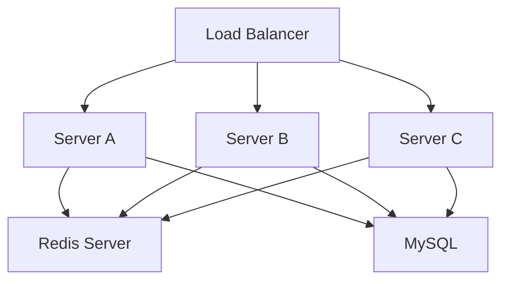

# Redis as a Distributed Cache (Part 1)

## Goal

Understand what Redis is, why distributed systems need it, how it works internally at a high level, and how it becomes a shared cache for multiple backend servers.

> **Technology Agnostic Note:** Redis is an independent in-memory database. Every backend technology (Java, Go, Node.js, Python, .NET, Rust, etc.) connects to Redis over TCP.

---

# 1. Why Do We Need Redis?

After horizontal scaling, we have multiple backend servers.

Each server has its own RAM.

```text
Server A RAM  ❌ Not shared
Server B RAM  ❌ Not shared
Server C RAM  ❌ Not shared
```

Problems:

- Sessions disappear on another server.
- Local cache is different on every server.
- Every server repeatedly queries the database for the same data.

We need **one shared memory system**.

Redis solves this.

---

# 2. What is Redis?

Redis is an **in-memory key-value database**.

It stores data primarily in RAM instead of SSD.

| MySQL | Redis |
|-------|-------|
| Table → Rows → Columns | Key → Value |
| Optimized for durable storage. | Optimized for extremely fast access. |
| Milliseconds. | Usually sub-millisecond. |

Think of Redis as a **shared memory server** that every backend server can access.

---

# 3. Where Does Redis Run?

Redis is a separate process.

It may run:

- On the same machine.
- On another server.
- As a managed cloud service.

Example architecture:



All backend servers connect to the **same Redis instance**.

---

# 4. How Does a Backend Connect to Redis?

The backend opens TCP connections to Redis.

Just like MySQL:

- Redis has its own port.
- Backend maintains a connection pool.
- Commands are sent over TCP.

Default Redis port:

| Service | Port |
|----------|------|
| Redis | **6379** |

---

# 5. What is a Key-Value Store?

Redis stores everything as:

```text
Key  -> Value
```

Examples:

| Key | Value |
|-----|-------|
| `session:abc123` | User session object |
| `product:101` | Product JSON |
| `cart:user5` | Shopping cart |
| `otp:9876543210` | OTP code |

Keys are strings.

Values can be many Redis data structures.

---

# 6. Why is Redis So Fast?

Redis stores data in RAM.

RAM access is much faster than SSD.

Typical flow:

Without Redis:

```text
Backend
   │
Database (SSD-backed)
```

With Redis:

```text
Backend
   │
 Redis (RAM)
   │
Database
```

Most reads avoid the database completely.

---

# 7. Redis is a Shared Cache

Suppose Server A loads product information.

Without Redis:

- Server A queries DB.
- Server B queries DB again.
- Server C queries DB again.

Three database queries.

With Redis:

1. First request queries DB.
2. Data stored in Redis.
3. Every server reads from Redis.

Database load decreases dramatically.

---

# 8. What is Caching?

Caching means storing frequently accessed data closer to the application.

Example:

```sql
SELECT * FROM products WHERE id=101;
```

Instead of executing this every time:

Store result in Redis.

Next requests return cached value.

---

# 9. Cache Read Flow

### Cache Hit

1. Backend asks Redis.
2. Redis has the value.
3. Response returned immediately.

Database is never touched.

### Cache Miss

1. Backend asks Redis.
2. Redis does not have the value.
3. Backend queries MySQL.
4. Result stored in Redis.
5. Response returned.

This is called **Cache-Aside Pattern**.

---

# 10. Cache-Aside Pattern (Most Common)

Step-by-step:

1. Read from Redis.
2. If key exists → Return it.
3. If key doesn't exist → Read DB.
4. Save result in Redis.
5. Return result.

Example:

```text
Redis MISS
      │
      ▼
MySQL
      │
      ▼
Save in Redis
      │
      ▼
Return to User
```

Most production applications use this pattern.

---

# 11. What Can We Cache?

Good candidates:

| Data | Cache? |
|------|--------|
| Product details | ✅ Yes |
| Restaurant details | ✅ Yes |
| Feature flags | ✅ Yes |
| Currency rates | ✅ Yes |
| User profile | ✅ Often |
| Session | ✅ Yes |
| Frequently changing bank balance | ⚠️ Usually No |

Cache data that is read frequently and updated relatively infrequently.

---

# 12. Redis Data Types

Redis supports multiple value types.

| Type | Example Use Case |
|------|------------------|
| String | Session, Product JSON, OTP |
| Hash | User profile fields |
| List | Notifications |
| Set | Unique user IDs |
| Sorted Set | Leaderboard, Nearby partners |
| Stream | Event processing |

We'll study each one later when needed.

---

# 13. Strings (Most Common)

Example:

```text
Key:
product:101

Value:
{"name":"Milk","price":52}
```

Used for:

- Sessions.
- Cached API responses.
- Tokens.
- OTPs.

---

# 14. Hashes

Store multiple fields under one key.

Example:

```text
Key:
user:5

Fields:
name -> Varun
age -> 24
city -> Delhi
```

Useful when updating individual fields.

---

# 15. TTL (Time To Live)

A cache entry can expire automatically.

Example:

| Key | TTL |
|-----|-----|
| `otp:9876543210` | 5 minutes |
| `session:abc123` | 30 minutes |
| `product:101` | 1 hour |

After TTL expires, Redis deletes the key automatically.

This prevents stale cache entries from living forever.

---

# 16. Why TTL is Important

Without TTL:

- Cache grows continuously.
- Old data remains forever.
- Memory fills up.

TTL helps Redis clean temporary data automatically.

---

# Interview Takeaways

- Redis is an in-memory key-value database used as shared memory across backend servers.
- Redis is a separate server accessed over TCP (default port 6379).
- Cache-Aside is the most common caching pattern in production.
- Cache hits avoid database queries; cache misses fetch from the database and populate Redis.
- TTL automatically removes temporary data such as sessions and OTPs.
- Redis becomes the shared cache that solves the local-cache problem introduced by horizontal scaling.


# Redis as a Distributed Cache (Part 2)

## Goal

Understand how Redis is used in production systems, how caches stay consistent with the database, and how real-world Redis failures are handled.

---

# 17. Cache Invalidation — The Hardest Problem

Keeping cache synchronized with the database is one of the hardest problems in distributed systems.

Example:

Product price changes.

```sql
UPDATE products
SET price = 55
WHERE product_id = 101;
```

Redis still has:

```json
{"price":52}
```

Users now see stale data.

---

# 18. Cache-Aside Write Flow (Production Standard)

Most production systems use **Cache-Aside**.

### Read

1. Check Redis.
2. If miss → Read DB.
3. Save in Redis.

### Write

1. Update database.
2. Delete cache entry.
3. Next read repopulates Redis.

### Why Delete Instead of Updating Redis?

Because the database is the **source of truth**.

Deleting avoids stale or partially updated cache entries.

> **Production Best Practice:** Update DB first, then invalidate the cache.

---

# 19. Why Not Update Redis First?

Wrong order:

1. Update Redis.
2. Database update fails.

Now Redis contains incorrect data.

Always commit the database first.

---

# 20. Real World Problem — Cache Stampede

Suppose `product:101` expires.

100,000 users request it simultaneously.

Result:

- Redis MISS for everyone.
- Every request queries MySQL.
- Database gets overloaded.

This is called **Cache Stampede**.

# Cache Stampede — Deep Dive

## Problem

Suppose `product:101` is one of the hottest products.

It has a TTL of **1 hour**.

At exactly 6:00 PM the cache expires.

Suddenly **100,000 users** request the same product.

### Without Protection

```text
Redis
   │
   ├── MISS
   ├── MISS
   ├── MISS
   ├── MISS
   └── MISS (100,000 times)

All requests hit MySQL simultaneously.
```

Result:

- Redis has no value.
- Every request queries MySQL.
- Database gets overloaded.
- Response latency increases dramatically.

This is called a **Cache Stampede**.

---

## Solution 1 — Single Flight / Request Coalescing (Most Common)

Idea:

> Only **one request** is allowed to fetch data from MySQL. Every other request waits for that result.

### Step-by-Step

1. 100,000 requests arrive.
2. Request **R1** notices cache miss.
3. R1 starts fetching from MySQL.
4. Requests **R2...R100000** do **not** query MySQL.
5. They wait for R1.
6. R1 stores data in Redis.
7. Waiting requests read the newly cached value.

### Flow

```text
100,000 Requests
       │
       ▼
Redis MISS
       │
       ▼
Request R1 → MySQL
       │
       ▼
Store value in Redis
       │
       ▼
All waiting requests read Redis
```

### Why It's Good

- Only **one database query**.
- Database load stays low.
- Very common in backend services.

> **Production Practice:** Many companies implement request coalescing inside the application process.

---

## Solution 2 — Distributed Lock (Works Across Multiple Servers)

Single Flight works well inside one server.

But what if we have **10 backend servers**?

Each server receives cache misses.

Without coordination:

- Server A queries MySQL.
- Server B queries MySQL.
- Server C queries MySQL.

Still multiple DB queries.

### Solution

Use Redis itself as a lock.

### Step-by-Step

1. Cache miss occurs.
2. Server A acquires lock `lock:product:101`.
3. Server B tries to acquire the lock → fails.
4. Server C tries → fails.
5. Server A queries MySQL.
6. Server A updates Redis.
7. Server A releases the lock.
8. Other servers read Redis.

### Flow

```text
Server A ── Acquires Lock ──► MySQL
Server B ── Waits
Server C ── Waits

After cache is filled:

Server B → Redis
Server C → Redis
```

### Why It's Needed

The lock is **shared across all servers**, so only one machine rebuilds the cache.

> **Production Practice:** Redis distributed locks are commonly used for rebuilding expensive cache entries.

---

## Solution 3 — Stale-While-Revalidate (Best User Experience)

Idea:

> Serve slightly old data immediately while refreshing the cache in the background.

### Example

Cached product price:

```
₹52
```

TTL expires.

Instead of making users wait:

1. User receives cached value `₹52`.
2. Background worker fetches fresh value `₹55`.
3. Redis is updated.
4. Next user receives `₹55`.

### Flow

```text
Redis has expired value
        │
        ├── Return stale value immediately
        │
        ▼
Background refresh from MySQL
        │
        ▼
Update Redis
```

### Why It's Good

- Very low latency.
- No request waits.
- Excellent for product catalogs, restaurant menus, news feeds, etc.

### Trade-off

Users may see **slightly stale data** for a few seconds.

---

# Which Solution Do Big Companies Use?

| Situation | Preferred Solution |
|-----------|--------------------|
| Hot cache key inside one server | **Single Flight / Request Coalescing** |
| Hot cache key across many backend servers | **Redis Distributed Lock** |
| Data can tolerate a few seconds of staleness | **Stale-While-Revalidate** |
| Extremely hot product/catalog APIs | Often **Stale-While-Revalidate + Single Flight** together. |

### Interview Takeaway

Cache stampede means **many requests rebuild the same cache simultaneously**.

Production systems prevent it by ensuring **only one request rebuilds the cache**, or by **serving stale data while refreshing it in the background**.


Large companies commonly use request coalescing or distributed locking.

---

# 21. Real World Problem — Cache Avalanche

Millions of keys have TTL = 1 hour.

Exactly after one hour:

- Millions of keys expire.
- Massive traffic hits MySQL.

### Solution

Use **TTL Jitter**.

Instead of:

```
TTL = 3600 seconds
```

Use:

```
TTL = 3600 ± random(0-300)
```

Keys expire gradually instead of simultaneously.

This is standard production practice.

---

# 22. Real World Problem — Cache Penetration

Users request data that doesn't exist.

Example:

```
product:999999999
```

Redis miss.

Database miss.

Every request still reaches the database.

### Solutions

#### Null Caching

Store:

```
product:999999999 -> NULL
TTL = 5 minutes
```

Future requests stop at Redis.

#### Bloom Filter

Maintain a probabilistic structure.

If Bloom Filter says key definitely doesn't exist:

- Skip Redis.
- Skip Database.

Useful for extremely high traffic systems.

---

# 23. Real World Problem — Redis Memory Full

Redis stores data in RAM.

RAM eventually fills.

### Eviction Policies

| Policy | Meaning |
|--------|---------|
| `allkeys-lru` | Remove least recently used key. |
| `allkeys-lfu` | Remove least frequently used key. |
| `volatile-lru` | Remove only keys with TTL. |
| `noeviction` | Reject new writes when memory is full. |

### Production Best Practice

- Session cache → TTL + LRU/LFU.
- Product cache → LFU is commonly preferred.

---

# 24. Real World Problem — Redis Crash

Redis stores data in RAM.

If Redis crashes:

- Cache disappears.
- Sessions disappear (if Redis stores sessions).

### Does the Application Stop?

No.

Typical behavior:

1. Redis unavailable.
2. Backend queries MySQL.
3. Higher latency.
4. Redis recovers.
5. Cache is gradually rebuilt.

This is called **Cache Warm-Up**.

Applications should continue working without Redis.

---

# 25. Cache Warm-Up

Cold Redis means every key is missing.

### Production Strategies

- Lazy loading (Cache-Aside).
- Preload popular products during deployment.
- Background warm-up jobs.

Blinkit/Uber commonly warm popular catalog data after deployments.

---

# 26. Redis Persistence — Isn't Redis Only in RAM?

Redis is primarily in-memory but can persist data to SSD.

Two mechanisms:

| Mechanism | Purpose |
|-----------|---------|
| RDB | Point-in-time snapshots. |
| AOF | Append every write command to a log. |

This reduces data loss after crashes.

---

# 27. RDB vs AOF

| RDB | AOF |
|-----|-----|
| Periodic snapshot. | Every write appended to log. |
| Faster restart. | Better durability. |
| Smaller file. | Larger file. |
| May lose recent writes. | Usually loses very little data. |

### Production Practice

Many deployments enable **both**.

- RDB for faster recovery.
- AOF for durability.

---

# 28. Redis Replication

A single Redis server becomes a SPOF.

### Production Architecture

```text
Backend Servers
        │
        ▼
Redis Primary
   │
   ▼
Redis Replica 1
Redis Replica 2
```

Primary handles writes.

Replicas synchronize automatically.

---

# 29. What Happens If Redis Primary Fails?

Production uses **Redis Sentinel** or **Redis Cluster**.

Sentinel:

- Detects failure.
- Promotes a replica.
- Clients reconnect automatically.

This provides automatic failover.

---

# 30. Redis Cluster

Large datasets may not fit into one machine.

Redis Cluster partitions keys across multiple Redis nodes.

Example:

| Key Range | Node |
|-----------|------|
| Product keys | Node A |
| Session keys | Node B |
| Cart keys | Node C |

This is horizontal scaling for Redis itself.

---

# 31. Redis Connection Pool

Backends do **not** open one TCP connection per request.

Each server maintains a Redis connection pool.

Benefits:

- Reuse TCP connections.
- Lower latency.
- Higher throughput.

Exactly the same idea as the database connection pool.

---

# 32. Redis Pipelining

Instead of sending commands one by one:

```
GET key1
GET key2
GET key3
```

Send them together.

Redis processes them without waiting for every response.

Reduces network round trips.

Production systems use pipelining heavily for batch reads.

---

# 33. Common Redis Use Cases

| Use Case | Redis Data Type |
|----------|-----------------|
| User Session | String / Hash |
| OTP | String + TTL |
| Shopping Cart | Hash |
| Rate Limiter | String + TTL / Sorted Set |
| Leaderboard | Sorted Set |
| Nearby Partners | GEO / Sorted Set |
| API Response Cache | String |
| Feature Flags | Hash |

---

# 34. Production Best Practices

- Use **Cache-Aside** for most application caches.
- Always update the **database first**, then invalidate Redis.
- Add **TTL jitter** to avoid cache avalanches.
- Protect hot keys using **single-flight** or distributed locks.
- Cache negative lookups (NULL caching) for a short time.
- Use **Redis replication** for high availability.
- Use **connection pooling** and **pipelining** for high throughput.
- Design the application so it can continue working if Redis is temporarily unavailable.

---

# 35. Interview Takeaways

- Cache invalidation is solved using Cache-Aside in most production systems.
- Cache stampedes are prevented using request coalescing or distributed locking.
- Cache avalanches are mitigated using randomized TTLs.
- Cache penetration is mitigated using Bloom Filters or null caching.
- Redis is primarily in-memory but uses RDB and AOF for persistence.
- Redis replication and Sentinel/Cluster provide high availability in production.